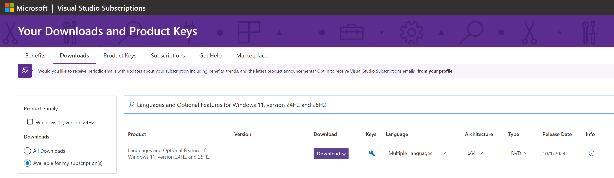
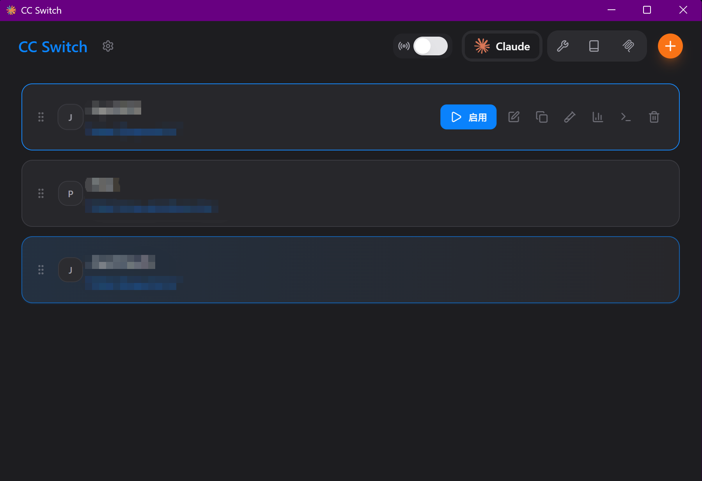

# 1.LaTeX  VS Code

GPT评价我原来的json配置（按照记忆应该是之前号生成的，那些号已被封，死无对证）：

```markdown
你这份 settings.json（LaTeX 部分）整体属于“懂行且能打”那种：配方/工具链齐全、outDir 也真的被工具参数用起来了、清理策略和 SyncTeX 都到位。基本上不是“能不能用”，而是“已经很好用了”。
……
总体评价：A- 到 A。把 outDir 换成 %DIR%/build、再补一个 lualatexmk，就更像“可维护的标准模板”了。
```

既然有缺陷，我叫它生成一个好的。

然后给我来了一坨大的，编译失败，全是报错（略）

后面让它找现成的：
```
https://www.koungmeng.com/blogs/setup-latex-in-vscode
https://github.com/James-Yu/LaTeX-Workshop/wiki/Compile
https://www.thrasos.dev/blog/latex-vscode
```

我基于[第一个链接](https://www.koungmeng.com/blogs/setup-latex-in-vscode)改进：

### ① 让 `%OUTDIR%` 明确等于主 `.tex` 所在目录

在最外层加这一行（建议放靠前）：

```json
"latex-workshop.latex.outDir": "%DIR%",
```

### ② 给 `latexmk` 工具加 `-auxdir=.../build`

找到你现在的 `latexmk` 工具（你的是 `-xelatex ... -outdir=%OUTDIR%` 那段），在 `-outdir` 前面插入一行：

```json
"-auxdir=%OUTDIR%/build",
```

排错/想看中间文件时，建议直接改成下面这样（最省事）：

```json
// 调试模式：不要自动清理，让 build/ 里保留证据
"latex-workshop.latex.autoClean.run": "never"
```

GPT给我写的倒数第二版的json，有很多莫名其妙的warning，比如

```
19: Use \"'\" (ASCII 39) instead of \"´\" (ASCII 180).
```

这是汉字编码问题，汉字 `UTF-8` 编码的后半部分字节被识别为了 \` ，被 `ChkTeX` 识别：`你不规范！` 最终我直接把 `json` 中 `chktex` 那几行删了


---

# 1.5 插曲：发现缺字体`SimHei`（前几天折腾字体搞替换所致）

```powershell
Add-WindowsCapability -Online -Name "Language.Fonts.Hans~~~und-HANS~0.0.1.0"
```

这命令需要在终端下载，不稳定，所以我问GPT能不能先下载文件，再直接安装文件

有的兄弟有的

https://my.visualstudio.com/Downloads

这里有压缩包，搜Languages and Optional Features for Windows 11, version 24H2 and 25H2

下载ISO



```powershell
Add-WindowsCapability -Online `
  -Name "Language.Fonts.Hans~~~und-HANS~0.0.1.0" `
  -Source "F:\LanguagesAndOptionalFeatures" `
  -LimitAccess
```

或者

```powershell
dism /online /add-capability /capabilityname:Language.Fonts.Hans~~~und-HANS~0.0.1.0 /source:F:\LanguagesAndOptionalFeatures /limitaccess
```


# 2.GPT Thinking内容不在上下文

```
我继续发 Prompt，会参考前几个 Stopped thinking 的 Thinking 内容吗？
不会。
“Thinking/推理过程”属于模型的内部中间过程，哪怕 UI 里出现了“Stopped thinking”，这些内部过程不会作为可被后续消息引用的上下文自动带到下一轮。

它参考的是对话上下文中可见的文本——也就是：
你发的消息（Prompt）
我发出来的回复（最终输出）
以及系统层面的一些设定（比如安全规则、风格设置等——你看不见，但确实存在）
```

# 3.Claude Code 套壳和 cc-switch
```
它们（MiniMax GLM）利用的不是 Claude Code 的代码（Code），而是 Claude Code 的协议（Protocol）。
Claude Code 就像一个高级的远程遥控机器人。
原版 是 Anthropic 的超级计算机拿着遥控器。
套壳 就是把遥控器的信号线拔了，插在 MiniMax 或 GLM 的脑子上。
```

`cc-switch` 切换不同的Claude配置（就是用户目录下的`.claude文件夹 settings.json`）

https://github.com/farion1231/cc-switch





## 一些Claude指令：

`/resume` 进入界面以后选择历史对话

`claude --resume` 终端进入选择历史对话界面

### 底下有一行提示：

`Ctrl+A to show all projects ·  · Ctrl+V to preview · Ctrl+R to rename · Type to search · esc to cancel · → to expand`

正常界面看到的是当前目录的对话 `Ctrl+A` 可以看到所有目录的对话

## Codex对应：（内容来自GPT回复）

`codex resume`：默认只给你看**当前工作目录**相关的会话（会弹出 picker 让你选）。

`codex resume --all`：picker 会显示**超出当前目录范围的所有本地会话**，相当于“全局历史”。

### 直接跳到“最近一次会话”

当前目录：`codex resume --last`

**所有目录**：`codex resume --last --all`

指定某次会话（从 picker /status 或磁盘里拿到 ID）：`codex resume <SESSION_ID>`

会话文件默认在 `~/.codex/sessions/`（想“只浏览不恢复”，直接在这里 grep/rg 也行）。


# 4.自动点击器无广告apk

我在telegram 破解软件中文频道 找到一个无广告版的 自动点击器

```
破解软件中文频道 🅥
自动点击器 V2.0.12.30会员版_@𝑷𝑱𝑨𝑷𝑲.apk
14.7 MB
#点击器 #自动点击器 @PJAPK

👥 频道       💬 群聊      🤖 投稿
❤3  8.44Kviews  19:29
```


